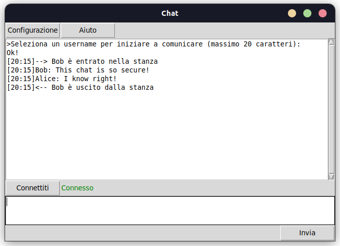

# Python-GUI-chat
## Cosa?
Una semplice applicazione per creare una chatroom su una rete locale tramite socket, usando la libreria [Tkinter](https://docs.python.org/3/library/tkinter.html) per la grafica. 
## Come?
#### Server:
  - Modificare host/port (defaults: localhost/4444)
  - Eseguire [server.py](server.py)
#### Client:
  - Modificare host/port (defaults: localhost/4444)
  - Eseguire [client.py](client.py)
  - Connettersi al server
  
  
## Perché?
Perché no

